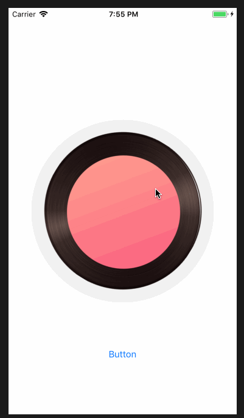

# Rotatable
一行代码，让你的 view 旋转起来



## Unsage

使用协议扩展，view 遵循Rotatable协议，就可以旋转起来。其实类似这种面向协议编程的这种写法，可以写很多这种的小插件，让某个控件拥有某种能力。

```
extension UIImageView: Rotatable {}
@IBAction func rotateAction(_ sender: UIButton) {
        imageView.rotate()        
}
```

Rotatable.swift

```
enum RotateState {
    case rotating
    case pause
    case none
}

private var ROTATABLE_ROTATESTATE : RotateState = .none
extension UIImageView: Rotatable {}

protocol Rotatable where Self: UIView{
    var rotateState: RotateState {get set}
    mutating func rotate()
}

extension Rotatable {
        var rotateState: RotateState {
        get {
            let result = objc_getAssociatedObject(self, &ROTATABLE_ROTATESTATE) as? RotateState
            if result == nil {
                return RotateState.none
            }
            return result!
        }
        set {
            objc_setAssociatedObject(self, &ROTATABLE_ROTATESTATE, newValue, objc_AssociationPolicy.OBJC_ASSOCIATION_RETAIN)
        }
    }
    
   mutating func rotate() {
        switch self.rotateState {
        case RotateState.rotating:
            pauseRotate()
        case RotateState.pause:
            resumeRotate()
        case RotateState.none:
            startRotate()
        }
    }
    
    mutating func startRotate() {
        let rotateAni = CABasicAnimation(keyPath: "transform.rotation")
        rotateAni.fromValue = 0.0
        rotateAni.toValue = Double.pi * 2.0
        rotateAni.duration = 10
        rotateAni.repeatCount = MAXFLOAT
        self.layer.add(rotateAni, forKey: nil)
        self.rotateState = .rotating
    }
    
    mutating func pauseRotate() {
        let pausedTime: CFTimeInterval = layer.convertTime(CACurrentMediaTime(), from: nil)
        layer.speed = 0.0
        layer.timeOffset = pausedTime
        
        self.rotateState = .pause

    }    
    mutating func resumeRotate() {   
        let pausedTime: CFTimeInterval = layer.timeOffset
        layer.speed = 1.0
        layer.timeOffset = 0.0
        layer.beginTime = 0.0
        let timeSincePause: CFTimeInterval = layer.convertTime(CACurrentMediaTime(), from: nil) - pausedTime
        layer.beginTime = timeSincePause
        
        rotateState = .rotating
        
    }
    
    mutating func stopRotate() {
        self.layer.removeAllAnimations()
        self.rotateState = .none
    }
    
}

```

